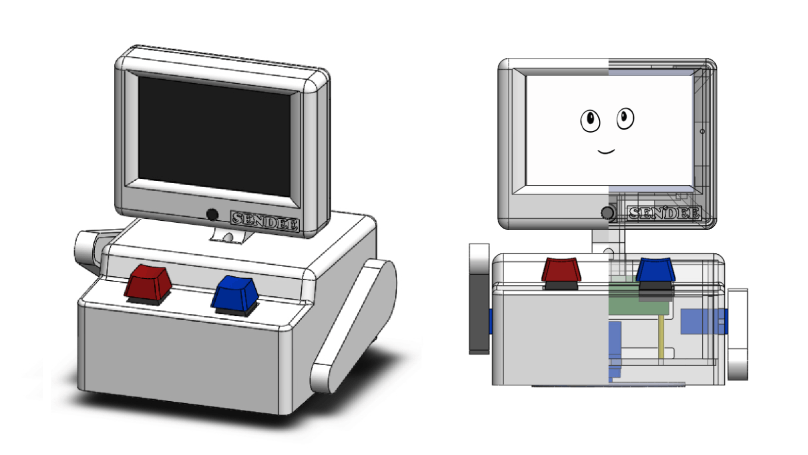
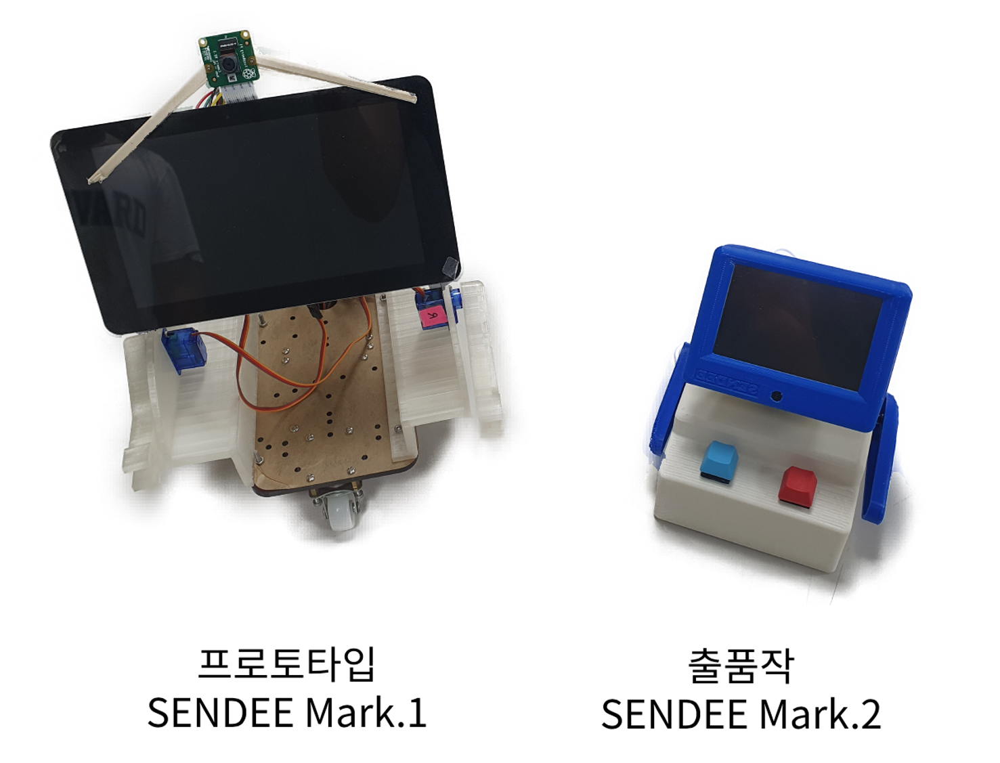
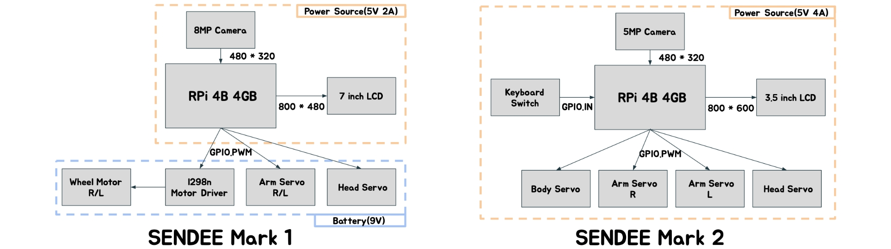
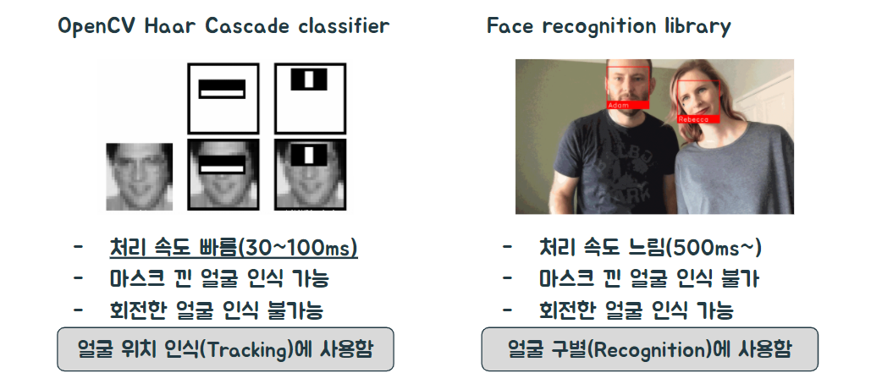
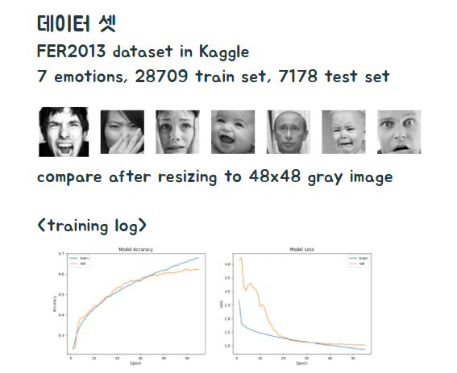
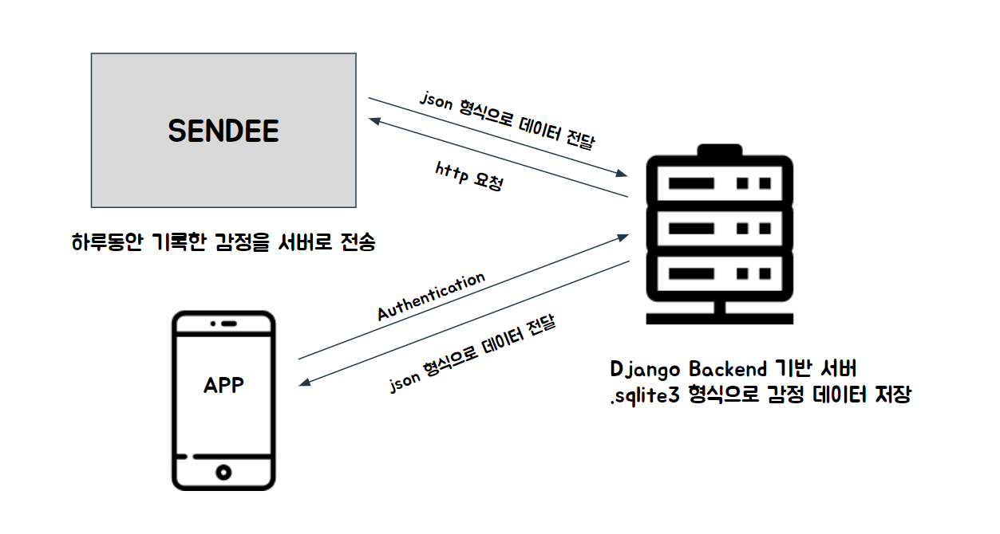

# 표정 분석 기술을 활용한 애완 로봇 및 감정 케어 서비스 SENDEE 

## Introduction

- **[소개 비디오](https://eng.snu.ac.kr/online/creativity/video/%EC%9E%84%EC%83%81%EC%9B%90.mp4)**
- [과제 보고서](./doc/과제보고서.pdf)
- [아이템 소개서](./doc/아이템소개서.pdf)

## Timeline

> 2020-03  "다학제 창의적 제품개발" 수업, 팀 결성
>
> 2020-06  프로토타입 제작
>
> 2020-09  공대 창의설계축전 출품
>
> 2020-10  서울대학교「초기창업패키지 사업」 창업동아리 지원

## 개선점

### Design

### Hardware

### Software

## 핵심 기술

### 얼굴인식

### 표정 인식

### 서버

## 작업 페이지

[구글독 주소](https://docs.google.com/document/d/19fvwSDl4GbWLj949ucSgLTSlWTZyokW1LeIa0JlTVQw/edit#heading=h.jtw3h5v9sgtr)

[git & github 매뉴얼](./doc/github-manual.md)